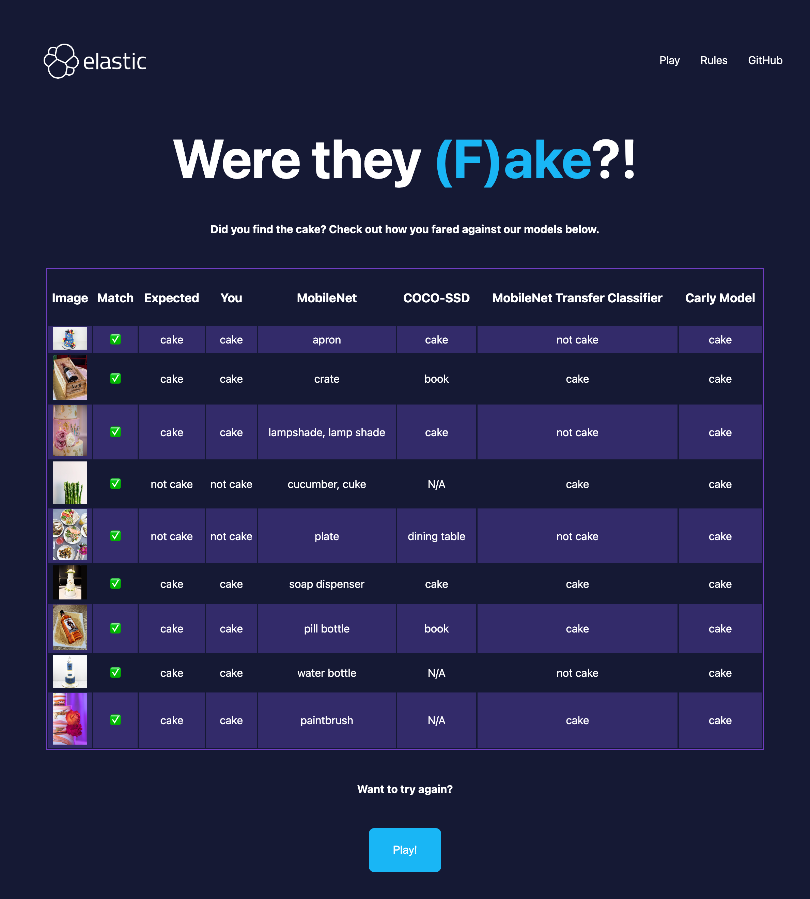

# Is it (F)ake?!

This is the implementaiton of the [Is it (F)ake?!](./cake-app/) game, where players can guess if the image is cake or not cake. 


They will also be able to compare their performance against common image models [MobileNet](https://github.com/tensorflow/tfjs-models/tree/master/mobilenet) and [COCO-SSD](https://github.com/tensorflow/tfjs-models/blob/master/coco-ssd/README.md).



This application is written using [React](https://react.dev/), [Elasticsearch Node.js client](https://github.com/elastic/elasticsearch-js) and [Netlify functions](https://www.netlify.com/platform/core/functions/).

## Prerequisites

You need an Elasticsearch cluster to pull the data from. Access is granted using environment variables `ELASTIC_URL` and `ELASTIC_API_KEY`, as per the [.env-example](./.env-example) file at the top of the project:

```zsh
ELASTIC_URL=https://my-elastic-deployment:port
ELASTIC_API_KEY=my-api-key
```

## How to run

Start the application on `http://localhost:5173/`, ensuring you have [Netlify CLI](https://docs.netlify.com/cli/get-started/) installed:

```
cd ./cake-game
npm install
npm install netlify-cli -g
netlify dev
```

Execute the component tests:

```
cd ./cake-game
npm install
npm run test-ct
```